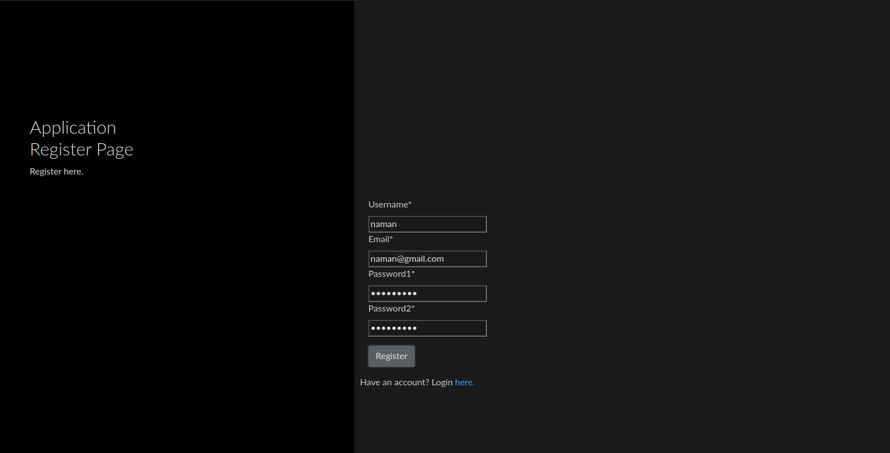

# my-app

## Table of Contents

- [About](#about)
- [Getting Started](#getting_started)
- [Post Install](#postinstall)
- [Screens](#screens)
## About <a name = "about"></a>
App to demonstrate use of JWT Token as a means of authorization using cookies as opposed to normal session based authentication.

## Getting Started <a name = "getting_started"></a>
Clone the repository and change directories
```
git clone https://github.com/shadyskies/nemesis-task.git
cd nemesis-task/
```
Install the required modules:
```
pip3 install -r requirements.txt
```

## Post Install<a name="postinstall"></a>
Either create a .env file in main directory having SECRET_KEY = '[any-value here]' or hard code it in settings.py. Migrate the auth and user model to db.
```
python3 manage.py migrate
```
Start the server.

```
python3 manage.py runserver
```


## Screens <a name = "screens"></a>




